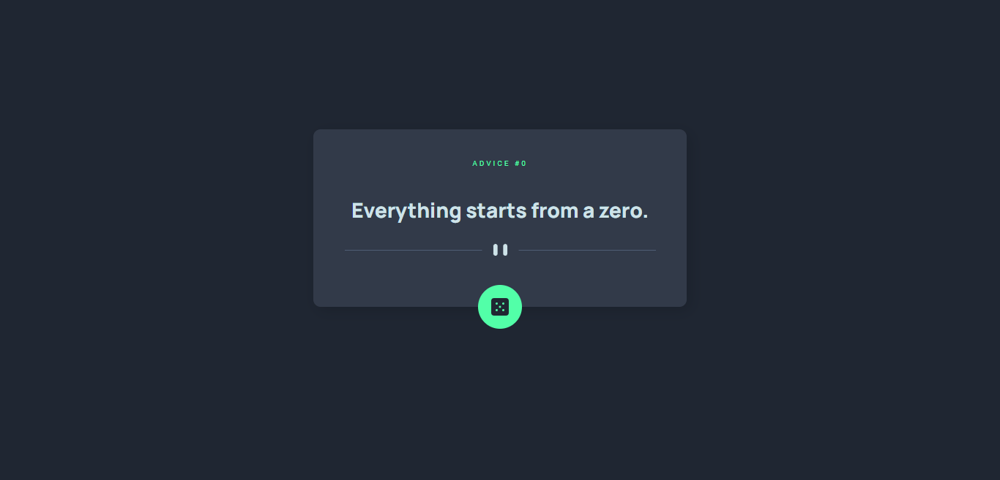
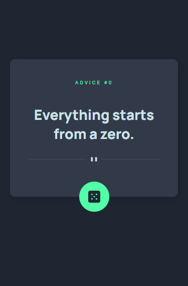

# Frontend Mentor - Advice generator app solution

This is a solution to the [Advice generator app challenge on Frontend Mentor](https://www.frontendmentor.io/challenges/advice-generator-app-QdUG-13db). Frontend Mentor challenges help you improve your coding skills by building realistic projects.

## Table of contents

- [Overview](#overview)
  - [The challenge](#the-challenge)
  - [Screenshot](#screenshot)
  - [Links](#links)
- [My process](#my-process)
  - [Built with](#built-with)
  - [What I learned](#what-i-learned)
  - [Continued development](#continued-development)
  - [Useful resources](#useful-resources)
- [Author](#author)
- [Acknowledgments](#acknowledgments)

## Overview

So here's a small overiew of what you guys might need to do if you ever wanna build this app ~ Acme

### The challenge

Users should be able to:

- Fetch API responses from [Advice Slip API](https://api.adviceslip.com/)
- Generate a random advice when the button is pressed
- Use Media Queries to adjust the size of the web app

### Screenshot

Here's a screenshot of my solution, and if you ever wanna add your own in your own repo, the easiest way to do this is to use a browser to view your project, and use your snipping tool to capture the image.

Normally I would use [Lightshot](https://app.prntscr.com/) or [Sharex](https://getsharex.com/) to take the screenshot with a hot-key. They both are free so you don't need to pay for them.

### Links

- Solution URL: [Front-End Mentor](https://your-solution-url.com)
- Live Site URL: [Github](https://your-live-site-url.com)

## My process

### Built with

- HTML5
- CSS custom properties
- Flexbox
- [React](https://reactjs.org/) - JS library

### What I learned

I believe in practice being a main part of learning process, and repeatingly used previous concepts allows people to be more productive and faster. With this exercise, I was able to put a better refresher on how to use React Components while building this application.

### Continued development

Since functional components are quite easier in reading ability in comparison to React Hooks, so here is what I wanted to try. I am planning to use React Hooks, however, React Components are quite handy when it comes to lifecycle development.

## Author

- [Website](https://www.your-site.com)
- Frontend Mentor - [@AcmeGamers](https://www.frontendmentor.io/profile/yourusername)
- Twitter - [@yourusername](https://www.twitter.com/yourusername)
